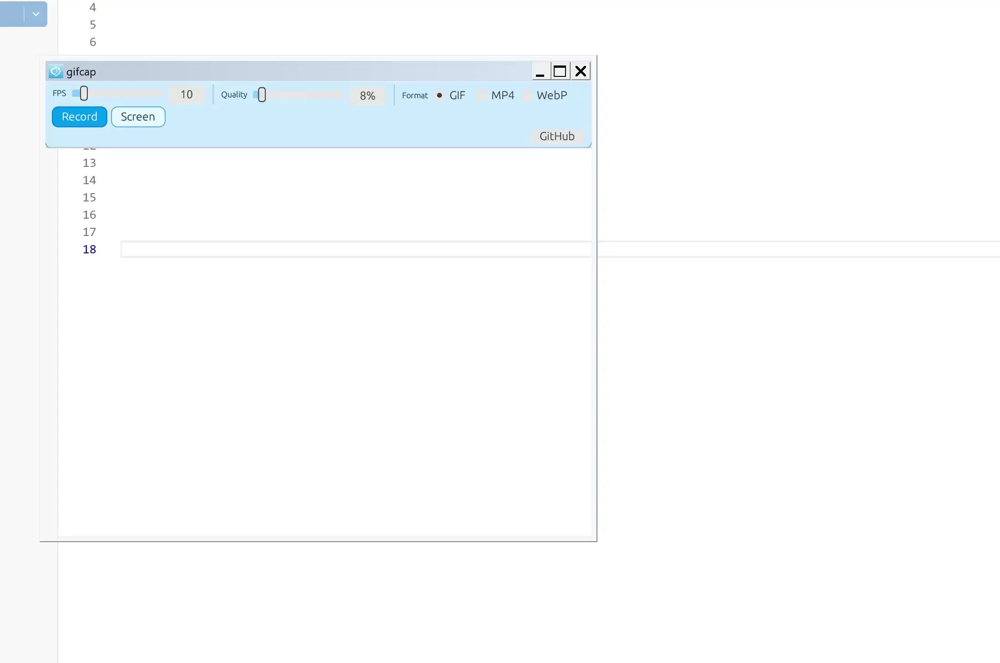

# gifcap

## 1. What It Is

Record a rectangular screen area **below** the app toolbar.

| Build | Recording | Export |
|---|---|---|
| **full** | GIF or MP4 | WebP generated from MP4 on save |
| **slim** | GIF only | PNG screenshot via `Screen` button (no WebP in FFmpeg) |

**Windows only**, Win32 + static FFmpeg (via vcpkg).



---

## 2. Usage

- Run `gifcap.exe`.
- The capture area is located below the top toolbar.
- Output files are saved to `%USERPROFILE%\Pictures\gifcap\`.
- During recording, intermediate files are stored in `%USERPROFILE%\.gifcap\active\` as `recording.gif` (slim and GIF mode) or `recording.mp4` (full in MP4/WebP modes).
- Log file: `%USERPROFILE%\.gifcap\logs\gifcap.log`.

## Changelog

### v1.1

- Added `Fullscreen Record`.
- During fullscreen recording, the app window is hidden and recording can be stopped from tray.
- Added `Move Up/Down` for moving the toolbar panel inside the window (top/bottom).
- Updated button text to `GitHub v1.1`.
- Translated app texts and documentation to English.

---

## 3. Dependencies

| Tool | Purpose | Source |
|---|---|---|
| **Git for Windows** | Git Bash and `cygpath` path conversion for `vcpkg.exe` | [git-scm.com](https://git-scm.com/download/win) |
| **Visual Studio** or Build Tools, workload **Desktop development with C++**, **x64** | MSVC toolchain and linker | [Visual Studio](https://visualstudio.microsoft.com/) |
| **Clang / LLVM** (VS component *C++ Clang Compiler for Windows* or standalone [LLVM](https://github.com/llvm/llvm-project/releases)) | `libclang.dll` required by bindgen | see `LIBCLANG_PATH` below |
| **Rust** toolchain **`stable-x86_64-pc-windows-msvc`** | `cargo`, `rustc` | [rustup.rs](https://rustup.rs/) |
| **vcpkg** (cloned repo + `bootstrap-vcpkg.bat`) | FFmpeg build and linkage | [microsoft/vcpkg](https://github.com/microsoft/vcpkg) |

Set these variables before building:

```bash
export VCPKG_ROOT=/c/path/to/vcpkg
export LIBCLANG_PATH="/c/Program Files/Microsoft Visual Studio/.../VC/Tools/Llvm/x64/bin"
```

For manual slim builds, also set `FFMPEG_DIR` to the slim install prefix in `vcpkg_installed_slim`.

---

## 4. Manual Build (Git Bash)

```bash
cd /c/path/to/gifcap
export VCPKG_ROOT=/c/path/to/vcpkg
export LIBCLANG_PATH="/c/.../Llvm/x64/bin"

WIN_ROOT="$(cygpath -w "$PWD")"
TRIPLET=x64-windows-static-md-release
```

### 4.1 vcpkg full

```bash
export VCPKG_OVERLAY_PORTS="$(cygpath -w "$PWD/vcpkg-overlays/full")"
WIN_INSTALL="$(cygpath -w "$PWD/vcpkg_installed_full")"

"$VCPKG_ROOT/vcpkg.exe" install \
  --triplet "$TRIPLET" \
  --x-manifest-root="$WIN_ROOT" \
  --x-install-root="$WIN_INSTALL"
```

### 4.2 vcpkg slim

```bash
export VCPKG_OVERLAY_PORTS="$(cygpath -w "$PWD/vcpkg-overlays/slim")"
WIN_INSTALL="$(cygpath -w "$PWD/vcpkg_installed_slim")"

"$VCPKG_ROOT/vcpkg.exe" install \
  --triplet "$TRIPLET" \
  --x-no-default-features \
  --x-manifest-root="$WIN_ROOT" \
  --x-install-root="$WIN_INSTALL"
```

### 4.3 Cargo

Full:

```bash
cargo clean
cargo build --release -p gifcap
```

Slim:

```bash
export FFMPEG_DIR="$(cygpath -w "$PWD/vcpkg_installed_slim/$TRIPLET")"
cargo clean
cargo build --release -p gifcap --features slim
```

Artifact: `target/x86_64-pc-windows-msvc/release/gifcap.exe`.

---

## 5. Build Scripts

After setting `VCPKG_ROOT` and `LIBCLANG_PATH`, run:

```bash
./build-full.bash
./build-slim.bash
```

---

## 6. Licenses

See `LICENSE`, `NOTICE`, and `THIRD_PARTY.md`.

The source repository is intended to be **MIT** licensed (`LICENSE`). When FFmpeg from vcpkg is linked into binaries, FFmpeg licensing terms apply as well (see [ffmpeg.org/legal.html](https://ffmpeg.org/legal.html)).
